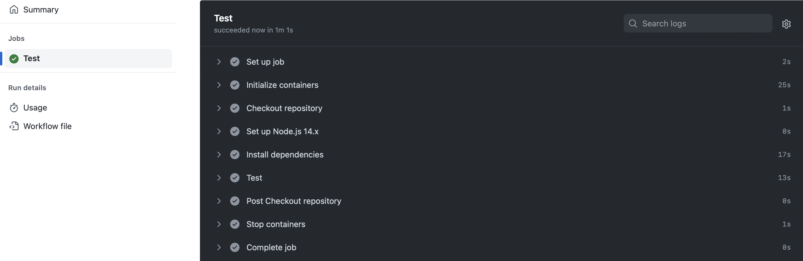
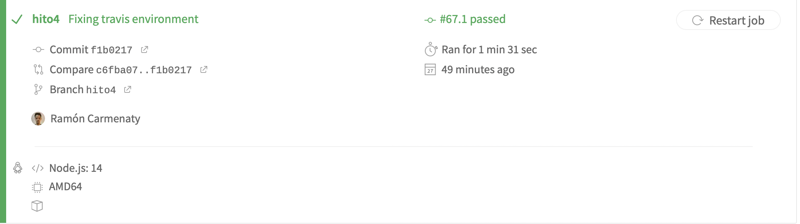

## Integración Continua

Se han definido para llevar a cabo la integración continua, como herramientas Github Actions y Travis, debajo información detallada de cada servicio.

### Github Actions

Para llevar a cabo la automatización de las pruebas definidas en la aplicación, se define el siguiente `workflow` de Github Actions:

```
on: [push]
jobs:
  Test:
    runs-on: ubuntu-latest
services:
      postgres:
        image: postgres
        env:
          POSTGRES_PASSWORD: postgres
          POSTGRES_USER: postgres
          POSTGRES_DB: travelshare
        ports:
          - 5432:5432
steps:
      - name: Checkout repository
        uses: actions/checkout@v2
      - name: Set up Node.js 14.x
        uses: actions/setup-node@v1
        with:
          node-version: 14.x
      - name: Install dependencies
        run: npm install
      - name: Test
        run: npm run test
```

- `on` define el trigger, es decir cuando se va a ejecutar el workflow
- `jobs` define los trabajos que se van a realizar, en este caso solo uno, el de ejecutar las pruebas.
- `services` se utliza para declarar los servicios necesarios además del código de la aplicación, en este caso solo postgres, acompañado de algunos otros datos de configuración como variables de entorno y los puertos a utilizar.
- `steps` define los pasos o tareas a realizar, por orden: checkout del repositorio, instalación de Nodejs, instalación de las dependencias y la ejecución de las pruebas.

Una vez realizado un push al repositorio la 'acción' se ejecutará, como se muestra en la imagen:

## 

---

### Travis

Para utilizar Travis es necesario darse de alta en su sitio web y autorizar acceso al respositorio de github sobre el que se quiere trabajar. Luego se define el archivo `.travis.yml` como sigue:

```
language: node_js
node_js:
  - "14"
services:
  - postgresql
addons:
  postgresql: "12"
  apt:
    packages:
      - postgresql-12
      - postgresql-client-12
env:
  global:
    - PGPORT=5433
    - NODE_ENV=travis
before_script:
  - psql -c "ALTER USER postgres WITH ENCRYPTED PASSWORD 'travis';"
  - psql -c 'create database travelshare;'
install:
  - npm install
jobs:
  include:
    - stage: test
      script:
        - npm run travis


```

En el que se especifica:

- `language` con lo que se define el lenguaje que será utlizado.
- `services` especifica los servicios que serán utilizados, similar a la configuración anterior, se define postgres como servicio a utlizar
- `env` variables de entorno, aquí se definen el puerto a utlizar por el servicio de postgres y el entorno de ejecución de NodeJs.
- `before_script` especifica acciones que se realizarán antes de la ejecución del script, como tareas de configuración, en este caso se asigna un password al usuario postgres y se crea la base de datos que se utlizará para realizar las pruebas.
- `install` se instalan las dependencias.
- `jobs` se definen las tareas a realizar.

Cuando se realiza un push al repo, automaticamente se lanza el build de travis, resultando en la imagen siguiente:


