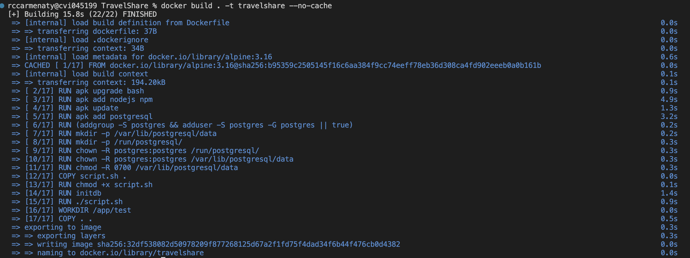
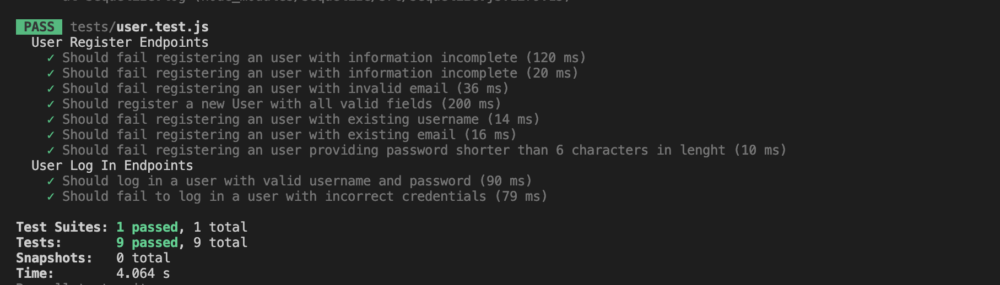

## Creación del contenedor para pruebas

### Empaquetado de la aplicación

La aplicación utiliza la distribución Alpine como base, sobre la cual se ejecutan varios servicios como Node y Postgres. Teniendo esto en cuenta, se define un `Dockerfile` en el cual se especifican las instrucciones para crear el contenedor de la aplicación. Se ha creado para la ejecución del contenedor, un script auxiliar en el que se ejecutan tareas de configuración de la base de datos, referenciado por `script.sh`.
A continuación una breve descripción de las órdenes utilizadas:

```

FROM alpine:3.16

ENV PGDATA="/var/lib/postgresql/data"

RUN apk add nodejs npm

RUN apk update

RUN apk add postgresql

RUN (addgroup -S postgres && adduser -S postgres -G postgres || true)

RUN mkdir -p /var/lib/postgresql/data

RUN mkdir -p /run/postgresql/

RUN chown -R postgres:postgres /run/postgresql/

RUN chown -R postgres:postgres - /var/lib/postgresql/data

RUN chmod -R 0700 /var/lib/postgresql/data

COPY script.sh .

RUN chmod +x script.sh

USER postgres:postgres

RUN initdb

RUN ./script.sh

WORKDIR /app/test

COPY . .

ENTRYPOINT [ "npm", "run", "test" ]
```

- Se parte de la imagen de la distribución Alpine versión 3.16.

- Se define la variable de entorno PGDATA, donde se especifica el directorio que se utilizará como localización de archivos de datos y configuración del gestor de base de datos Postgres.

- Se ejecuta la orden de instalar Node y NPM como gestor de paquetes de la plataforma.

- APK update corresponde a la orden de actualizar los paquetes en la distro Alpine.

- Se ejecuta la orden de instalar el gestor de base de datos Postgres.

- Se ejecuta la orden de crear grupo y usuario `postgres` para posteriormente ser utilizado en tareas de configuración de la base de datos.

- Se crea el directorio donde recidirán los archivos de datos y configuración del gestor de base de datos Postgres.

- Se crea el directorio donde generalmente reciden archivos de ejecución relacionados con el lanzamiento del proceso del gestor de base de datos.

- Se modifica el usuario y grupo al que pertenece el directorio anteriormente creado, y se asigna al usuario y grupo postgres.

- Se modifica el usuario y grupo al que pertenece el directorio, y se asigna al usuario y grupo postgres.

- Se modifican los permisos sobre el directorio del gestor de base datos, dando acceso solo al owner a ejecución, lectura y escritura.

- Se copia el script de configuración de algunos parámetros de la base de datos.

- Se asignan permisos de ejecución sobre el script.

- Se cambia al usuario `postgres`.

- Se ejecuta la orden de iniciar un nuevo cluster de base de datos.

- Se ejecuta el script.

- Se define el directorio de trabajo como se especifica en el guion de la práctica.

- Se copian los archivos al contenedor

- Se define como entry point la orden `npm run test` para que se ejecuten las pruebas.

En el script definido las tareas que se realizan son las siguientes:

- Iniciar el servicio de base de datos.

- Definir un password para el usuario postgres.

- Crear la base de datos `travelshare`

- Detener el servicio.

```
#!/bin/sh

pg_ctl start
psql -c "ALTER USER postgres WITH ENCRYPTED PASSWORD 'postgres';"
psql -c "CREATE DATABASE travelshare;"
pg_ctl stop

```

Con la configuración lista, se puede proceder a ejecutar la orden `docker build . -t travelshare --no-cache`, para crear el contenedor con lo necesario para que se ejecuten las pruebas designadas:

\
 

Se procede a realizar la pruebas ejecutando el contenedor mediante la orden `docker run -t -v `pwd`:/app/test travelshare`, como se indica en el guion de la práctica, obteniendose el siguiente resultado:

\
 

En la imagen anterior se puede apreciar que se han realizado las pruebas correspondientes en el contenedor que se ha creado para ello.
