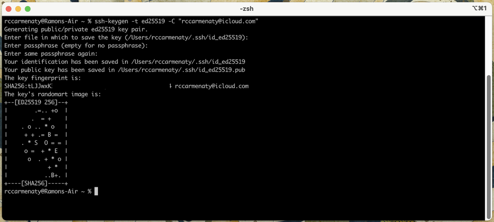
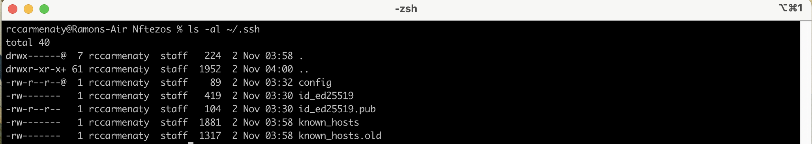
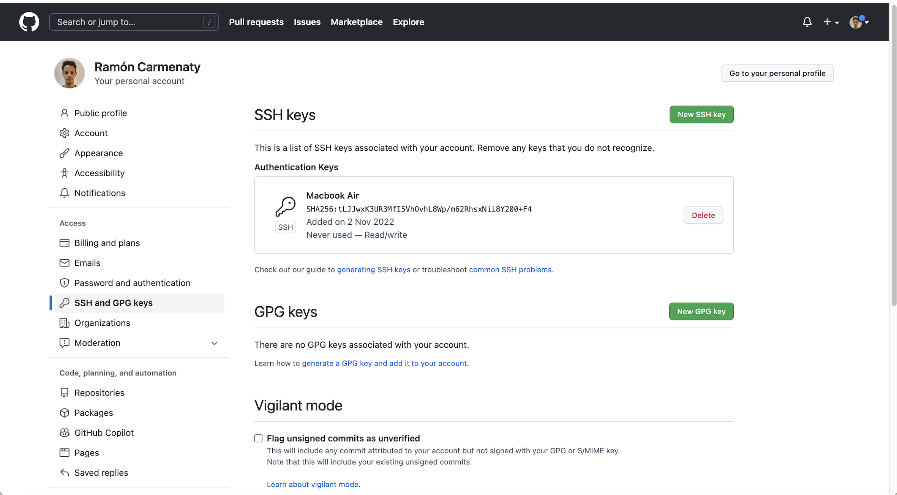
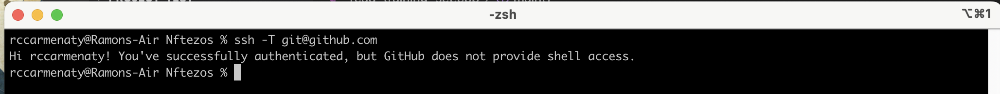

# Configuración de Git y creación del repositorio

### Instalar Git

En Macos si no tenemos instalado Git, podemos ejecutar la siguiente orden en la terminal:

```
xcode-select --install
```

### Configuración de Git

Para configurar Git y que se asocie toda actividad con nuestra identidad, debemos configurar nuestro nombre de usuario y correo electrónico, de la siguiente manera:

```
git config --global user.name "Ramón Carmenaty Cardero"
git config --global user.email "rccarmenaty@icloud.com"
```

### Creación de claves ssh para autenticarse en Github.

Si no estan creadas se genera un par de claves pública y privada como se muestra a continuación:


Luego podemos verificar que exactamente se han creado las claves en el directorio especificado previamente.


Posteriormente se debe proceder a añadir la clave previamente generada a nuestra cuenta de Github, como se indica [aquí](https://docs.github.com/en/authentication/connecting-to-github-with-ssh/adding-a-new-ssh-key-to-your-github-account)


Y se puede verificar que se han importado correctamente las claves generadas con la siguiente orden.


## Creación del repositorio

Creamos un repositorio nuevo, en el que se controlará el código del proyecto, desde el inicio añadimos la licencia y el archivo .gitignore.

